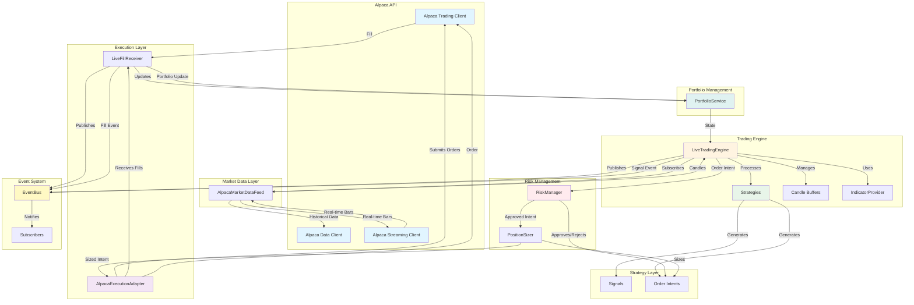
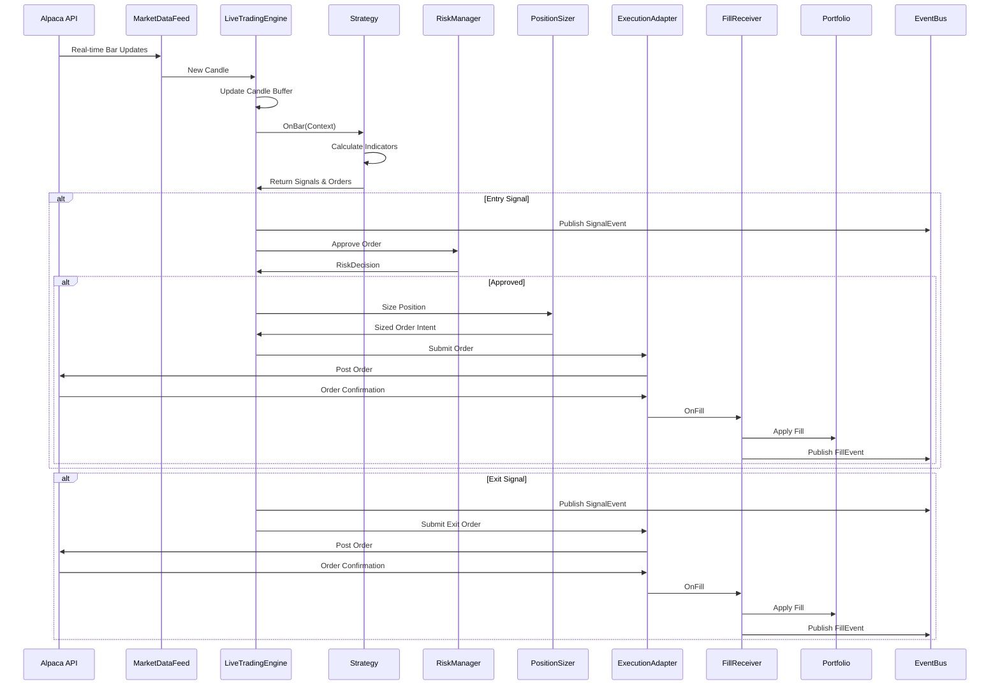

# Alpaca Live Trading Sample

This sample demonstrates how to use Bipins.Trading with Alpaca for live trading.

## Architecture



## Prerequisites

1. **Alpaca Account**: Sign up at https://alpaca.markets/
2. **API Credentials**: Get your API Key ID and Secret Key from the Alpaca dashboard
3. **.NET 8 SDK**: Required to run the application

## Setup

### 1. Set Environment Variables

**Windows (PowerShell):**
```powershell
$env:ALPACA_API_KEY_ID="your_api_key_id"
$env:ALPACA_SECRET_KEY="your_secret_key"
```

**Linux/Mac:**
```bash
export ALPACA_API_KEY_ID="your_api_key_id"
export ALPACA_SECRET_KEY="your_secret_key"
```

### 2. Build the Project

```bash
dotnet build samples/alpaca/Bipins.Trading.Samples.Alpaca.csproj
```

### 3. Run

**Paper Trading (default):**
```bash
dotnet run --project samples/alpaca/Bipins.Trading.Samples.Alpaca.csproj
```

**Live Trading (use with caution!):**
```bash
dotnet run --project samples/alpaca/Bipins.Trading.Samples.Alpaca.csproj -- live
```

## Data Flow



## Features

- **Real-time Market Data**: Subscribes to live bar updates from Alpaca
- **Order Execution**: Submits orders through Alpaca API
- **Portfolio Tracking**: Tracks positions and cash in real-time
- **Risk Management**: Enforces position limits and daily loss limits
- **Event-Driven**: Uses event bus for fill and signal notifications

## Configuration

The sample uses:
- **Strategies**: EMA Crossover and RSI Mean Reversion
- **Risk Limits**: Max 5 positions, 5% daily loss limit
- **Position Sizing**: 10% of equity per position
- **Symbols**: SPY and QQQ (configurable in code)

## Important Notes

⚠️ **Paper Trading First**: Always test with paper trading before using live trading.

⚠️ **Risk Management**: The sample includes basic risk management, but you should customize it for your needs.

⚠️ **Market Hours**: Alpaca only executes orders during market hours. Orders placed outside market hours will be queued.

## Customization

To customize the sample:

1. **Change Symbols**: Modify `GetStrategySymbols()` in `LiveTradingEngine.cs`
2. **Change Strategies**: Update the strategies array in `Program.cs`
3. **Adjust Risk Limits**: Modify risk policies in `Program.cs`
4. **Change Position Sizing**: Update `PercentEquitySizer` parameters

## Troubleshooting

- **Connection Errors**: Verify your API credentials are correct
- **No Orders**: Check that market is open and you have sufficient buying power
- **Data Issues**: Ensure your Alpaca account has market data access
