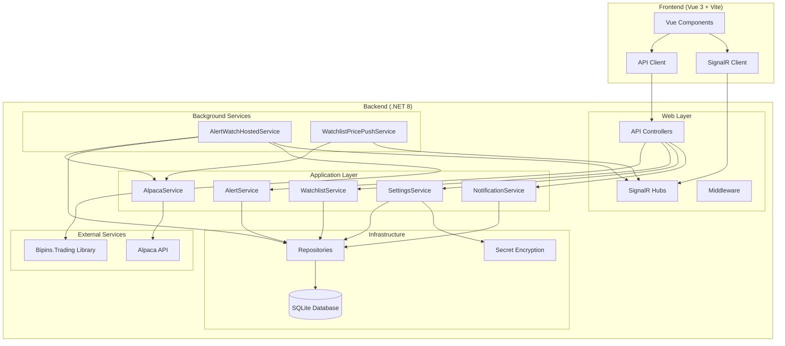
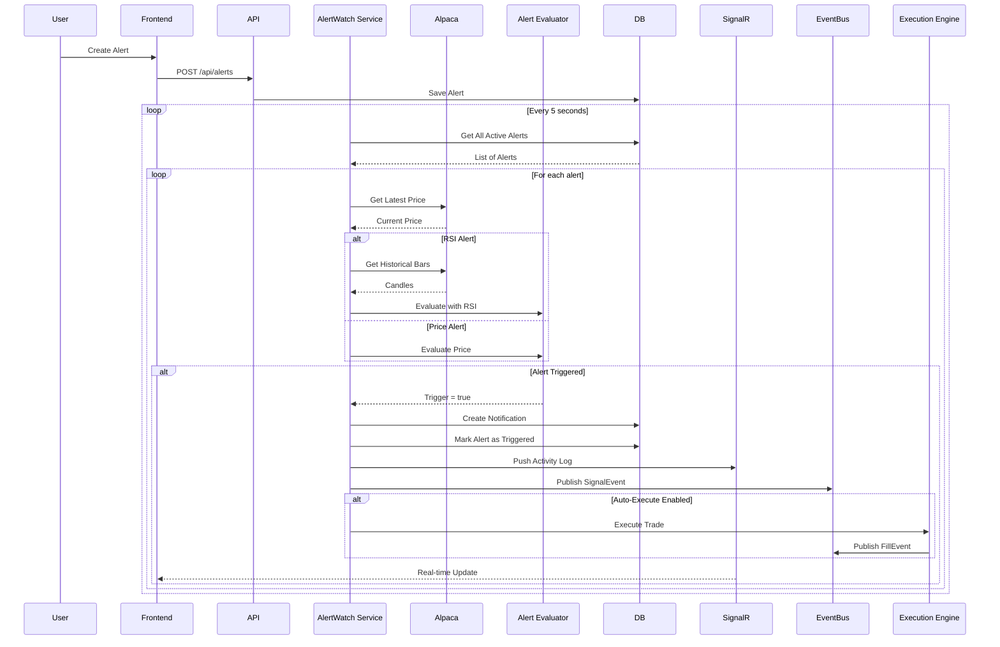
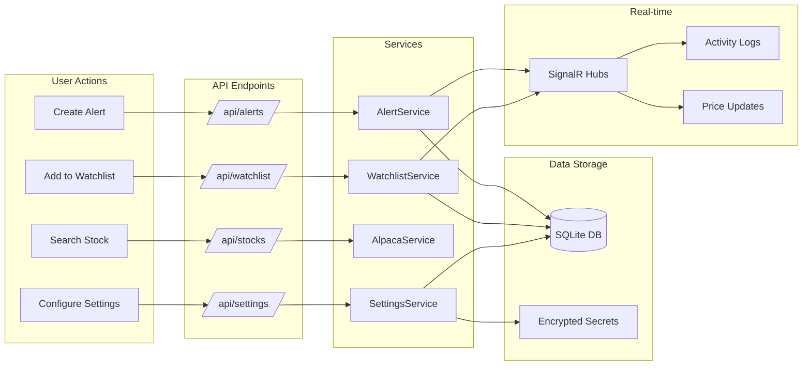
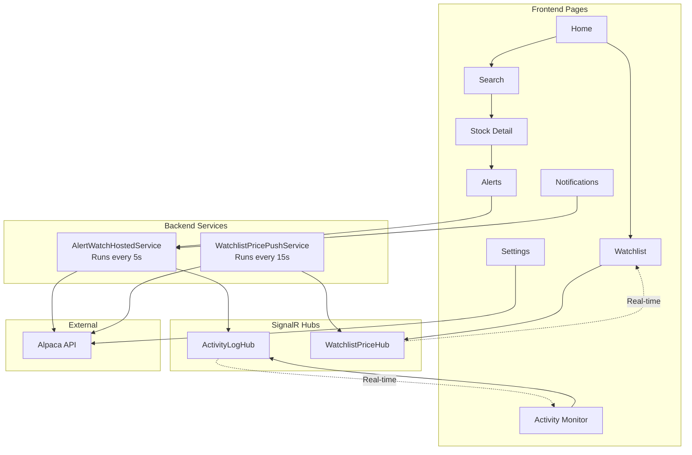

# Trading App

A modern, mobile-first trading application built with Vue 3 and .NET 8. Features real-time stock monitoring, price alerts, watchlist management, and automated trading execution using the Bipins.Trading library.

## Features

- 📊 **Stock Search & Details** - Search and view stock information via Alpaca API
- 📈 **Watchlist** - Track favorite stocks with real-time price updates via SignalR
- 🔔 **Price Alerts** - Set alerts for price thresholds and RSI indicators
- 📱 **Real-time Monitoring** - Activity logs with live SignalR updates
- 🔐 **Secure Settings** - Encrypted storage of Alpaca API credentials
- ⚡ **Auto-Execution** - Optional automated trade execution when alerts trigger
- 🧪 **Unit Tests** - Comprehensive test coverage for services and controllers

## Architecture



## How It Works

### Alert Evaluation Flow



### Data Flow



### Component Interactions



## Prerequisites

- .NET 8 SDK
- Node.js 18+ and npm (for frontend build and optional dev server)

## Quick Start

### 1. Build

From the **solution root** (`samples/tradingapp`):

```bash
dotnet build TradingApp.sln
```

### 2. Run

```bash
cd src/TradingApp
dotnet run
```

The application will:
- Apply database migrations automatically
- Start the API server on `http://localhost:5000`
- Serve the built SPA (if built) or API endpoints

### 3. Configure Alpaca API

**Option A - Via Settings UI:**
1. Navigate to the Settings page in the app
2. Enter your Alpaca API credentials
3. Settings are encrypted and stored in SQLite

**Option B - Via User Secrets (Development):**

```bash
cd src/TradingApp
dotnet user-secrets set "Alpaca:ApiKey" "YOUR_KEY"
dotnet user-secrets set "Alpaca:ApiSecret" "YOUR_SECRET"
dotnet user-secrets set "Alpaca:BaseUrl" "https://paper-api.alpaca.markets"
```

**Option C - Via Environment Variables (Production):**

```bash
export Alpaca__ApiKey="YOUR_KEY"
export Alpaca__ApiSecret="YOUR_SECRET"
export Alpaca__BaseUrl="https://paper-api.alpaca.markets"
```

### 4. Serve the Frontend

**Option A – Production (built SPA served by backend):**

```bash
cd src/TradingApp/Web/ClientApp
npm install
npm run build
cd ../..
dotnet run
```

Open http://localhost:5000 — the backend serves the built SPA from `Web/ClientApp/dist`.

**Option B – Development (Vite dev server + proxy):**

Terminal 1 – backend:
```bash
cd src/TradingApp
dotnet run
```

Terminal 2 – frontend:
```bash
cd src/TradingApp/Web/ClientApp
npm install
npm run dev
```

Open http://localhost:5173 — Vite proxies `/api` to the backend (port 5000). Hot reload works.

## Project Structure

```
TradingApp/
├── Application/          # Business logic and services
│   ├── AlertService.cs
│   ├── AlertTriggerEvaluator.cs
│   ├── AlpacaService.cs
│   ├── NotificationService.cs
│   ├── SettingsService.cs
│   ├── WatchlistService.cs
│   └── DTOs/            # Data Transfer Objects
├── Domain/              # Domain entities
│   ├── Alert.cs
│   ├── Notification.cs
│   ├── WatchlistItem.cs
│   └── AlpacaSettings.cs
├── Infrastructure/      # Data access and external integrations
│   ├── Repositories/
│   ├── AppDbContext.cs
│   ├── SecretEncryption.cs
│   └── Migrations/
├── Web/                 # Web API and frontend
│   ├── Controllers/     # API controllers
│   ├── Hubs/           # SignalR hubs
│   ├── Services/       # Background services
│   └── ClientApp/      # Vue 3 frontend
└── TradingApp.Tests/    # Unit tests
```

## API Endpoints

| Method | Endpoint | Description |
|--------|----------|-------------|
| GET | `/api/stocks/search?q=` | Search assets (Alpaca) |
| GET | `/api/stocks/{symbol}` | Stock detail |
| GET | `/api/watchlist` | List watchlist |
| POST | `/api/watchlist` | Add symbol to watchlist |
| DELETE | `/api/watchlist/{symbol}` | Remove from watchlist |
| GET | `/api/settings/alpaca` | Get masked Alpaca settings |
| POST | `/api/settings/alpaca` | Save Alpaca settings |
| GET | `/api/alerts?symbol=` | List alerts for symbol |
| POST | `/api/alerts` | Create alert |
| DELETE | `/api/alerts/{id}` | Delete alert |
| GET | `/api/notifications?limit=&unreadOnly=` | Recent notifications |
| PATCH | `/api/notifications/{id}/read` | Mark notification as read |
| GET | `/api/activity-logs?limit=&category=` | Get activity logs |
| DELETE | `/api/activity-logs` | Delete all activity logs |

**Swagger UI (Development):** http://localhost:5000/swagger

## Alert Types

### Price Alerts

- **PriceAbove** - Triggers when price exceeds threshold
- **PriceBelow** - Triggers when price falls below threshold

**Payload:** Threshold value (e.g., `"150.00"`)

### RSI Indicator Alerts

- **RsiOversold** - Triggers when RSI falls below threshold (default: 30)
- **RsiOverbought** - Triggers when RSI exceeds threshold (default: 70)

**Payload:** Optional comma-separated values:
- `period` (default: 14)
- `period,oversold,overbought` (e.g., `"14,30,70"`)

**Comparison Types:**
- `Above` - RSI > threshold
- `Below` - RSI < threshold
- `CrossesOver` - RSI crosses above threshold
- `CrossesBelow` - RSI crosses below threshold

## Background Services

### AlertWatchHostedService

- **Interval:** Every 5 seconds
- **Function:** 
  - Fetches all active (untriggered) alerts
  - Gets latest prices from Alpaca
  - For RSI alerts, fetches historical bars and computes RSI
  - Evaluates alert conditions
  - Creates notifications when triggered
  - Publishes SignalEvent to EventBus
  - Optionally executes trades if auto-execute is enabled

### WatchlistPricePushService

- **Interval:** Every 15 seconds
- **Function:**
  - Pushes real-time price updates to connected clients via SignalR
  - Only pushes prices for symbols that clients have subscribed to

## Auto-Execution

When an alert triggers and `EnableAutoExecute` is `true`, the system can automatically execute trades:

1. **SignalEvent** is published to EventBus
2. **IExecutionEngine** processes the signal
3. Order is submitted via Bipins.Trading's execution adapter
4. **FillEvent** is published when order fills

**Configuration:**

```json
{
  "Trading": {
    "ExecuteOnTrigger": true
  }
}
```

## Testing

Run all unit tests:

```bash
cd samples/tradingapp
dotnet test TradingApp.sln
```

The test project includes comprehensive coverage for:
- Application services (AlertService, NotificationService, SettingsService, WatchlistService)
- Alert evaluation logic (AlertTriggerEvaluator)
- API controllers (Alerts, Notifications, Settings, Watchlist, ActivityLogs)

## Database

The application uses **SQLite** for data persistence. Migrations are applied automatically on startup.

**Manual migration:**

```bash
cd src/TradingApp
dotnet ef database update
```

**Database file:** `tradingapp.db` (created in the application root)

## Security

- **API Credentials:** Stored encrypted using ASP.NET Core Data Protection
- **Key Storage:** Keys persisted to `dp-keys/` directory
- **Secrets:** Never logged or exposed in API responses (masked when retrieved)

## Real-time Features

### SignalR Hubs

1. **ActivityLogHub** - Pushes activity log entries in real-time
   - Categories: AlertWatch, QuoteIngestion, SignalGeneration
   - Levels: Debug, Info, Warning, Error

2. **WatchlistPriceHub** - Pushes price updates for watchlist symbols
   - Updates every 15 seconds
   - Only for subscribed symbols

## Development

### Building the Solution

```bash
cd samples/tradingapp
dotnet build TradingApp.sln
```

### Running Tests

```bash
cd samples/tradingapp
dotnet test TradingApp.sln --verbosity normal
```

### Frontend Development

```bash
cd src/TradingApp/Web/ClientApp
npm install
npm run dev
```

## Technology Stack

- **Backend:** .NET 8, ASP.NET Core, Entity Framework Core, SignalR
- **Frontend:** Vue 3, Vite, Vue Router, Pinia
- **Database:** SQLite
- **External APIs:** Alpaca Markets API
- **Trading Library:** Bipins.Trading
- **Testing:** xUnit, Moq, FluentAssertions

## License

This is a sample application demonstrating the Bipins.Trading library capabilities.
